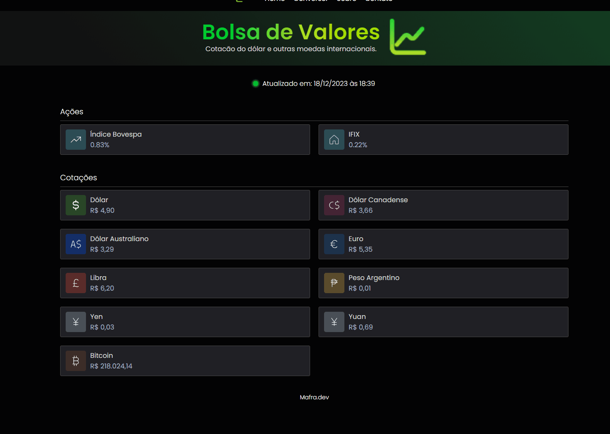

# Bolsa de valores

Um projeto desenvolvido em HTML , CSS , JS utilizando  a API da HG Brasil


## Funcionalidades
Esse projeto mostra a atual cotação de alguns ativos do mercado financeiro. Como BTC , IFIX , USD ... 




## Stack utilizada

**Front-end:** HTML , CSS , JS 

**API:** [HG BRASIL](https://hgbrasil.com/)


## Uso/Exemplos

```javascript
import Component from 'my-project'

function App() {
  return <Component />
}
```


## 🔗 Links
[](https://caiomafia.github.io/Portfolio/)
[](https://www.linkedin.com/in/caio-mafra/)


